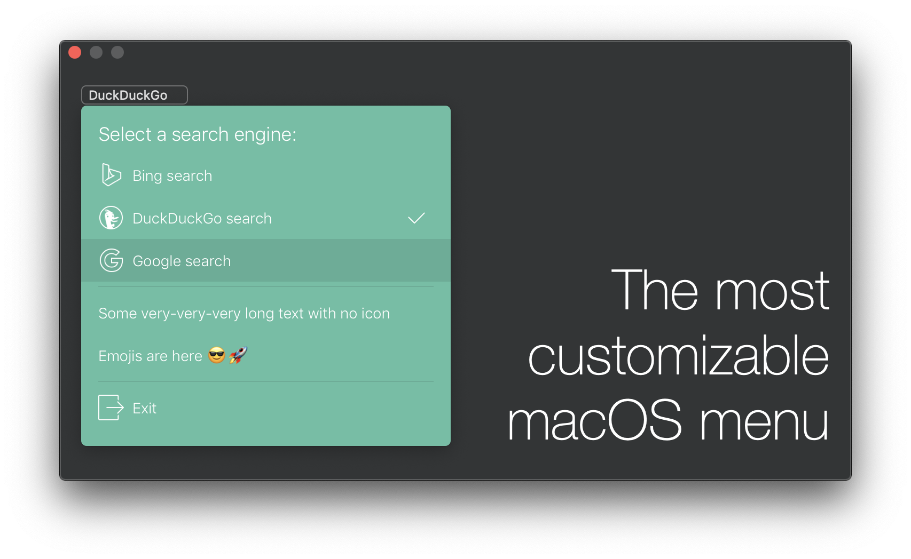
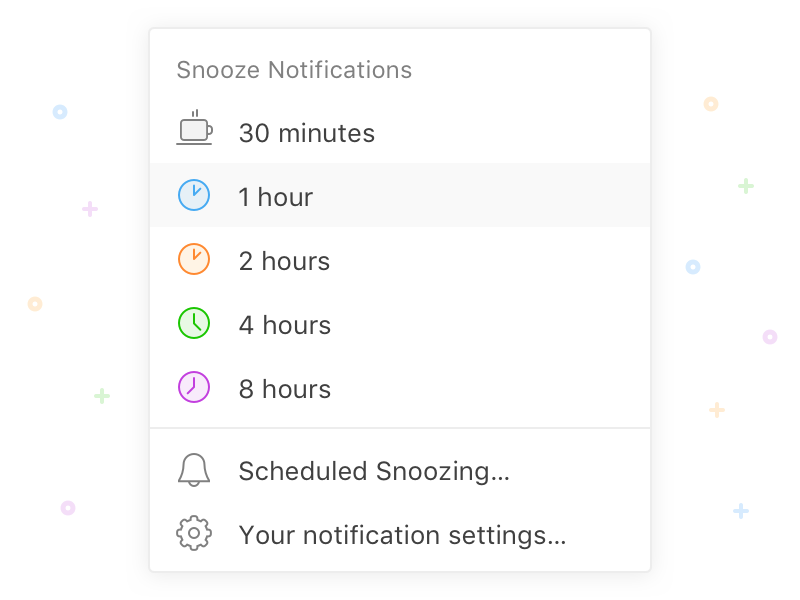
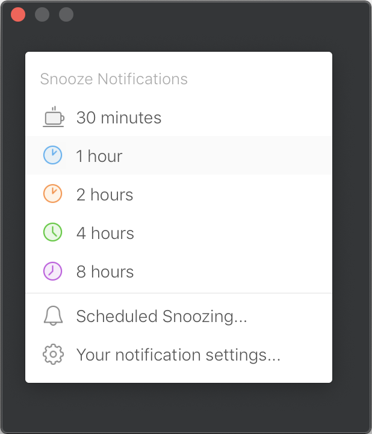

# Menu

<div align="center">


[](https://opensource.org/licenses/MIT)

</div>

>Fully customizable macOS drop-down menu. It includes **30** settings you can play with.



## Requirements

* Xcode 11+
* macOS 10.12+
* Swift 5.0 and higher

## Installation

Since this is a Swift Package, the installation process is pretty stright forward.

### Manual way
Update your `Package.swift` dependencies:

```
dependencies: [
    .package(url: "https://github.com/iSapozhnik/Menu", from: "1.10.0")
]
```

### Via Xcode:
1. Go to `File -> Swift Packages -> Add Package Dependency`. 
2. Put GitHub URL `https://github.com/iSapozhnik/Menu` and click `Next`
3. Select the latest version
4. Click `Finish`

## What can be customized? Everything!
```swift
public protocol Configuration {
    var titleBottomSpace: CGFloat                           { get }
    var titleFont: NSFont?                                  { get }
    var titleColor: NSColor                                 { get }
    var backgroundColor: NSColor                            { get }
    var cornerRadius: CGFloat                               { get }
    var hasShadow: Bool                                     { get }
    var appearsBelowSender: Bool                            { get }
    var presentingOffset: CGFloat                           { get }
    var animationDuration: TimeInterval                     { get }
    var contentEdgeInsets: NSEdgeInsets                     { get }
    var maximumContentHeight: CGFloat?                      { get }
    var separatorColor: NSColor                             { get }
    var separatorThickness: CGFloat                         { get }
    var separatorHorizontalPadding: Padding.Horizontal      { get }
    var separatorVerticlaPadding: Padding.Vertical          { get }
    var rememberSelection: Bool                             { get }
    var textAlignment: Alignment                            { get }
    var iconAlignment: Alignment                            { get }
    var menuItemFont: NSFont?                               { get }
    var menuItemHeight: CGFloat                             { get }
    var menuItemHoverBackgroundColor: NSColor               { get }
    var menuItemTextColor: NSColor                          { get }
    var menuItemHoverTextColor: NSColor                     { get }
    var menuItemCheckmarkColor: NSColor                     { get }
    var menuItemHoverCheckmarkColor: NSColor                { get }
    var menuItemCheckmarkHeight: CGFloat                    { get }
    var menuItemCheckmarkThikness: CGFloat                  { get }
    var menuItemImageHeight: CGFloat?                       { get }
    var menuItemImageTintColor: NSColor?                    { get }
    var menuItemHoverImageTintColor: NSColor?               { get }
    var menuItemHoverAnimationDuration: TimeInterval        { get }
}
```
## How to use

```swift
import Cocoa
import Menu

class ViewController: NSViewController {
    private let myMenu = Menu(with: "Select a search engine:")

    @IBOutlet var showMenuButton: NSButton!

    override func viewDidLoad() {
        super.viewDidLoad()

        let bing = MenuItem("Bing search", image: Icn.bing.image, action: { [weak self] in
            self?.showMenuButton.title = "Bing"
        })
        let item = MenuItem("DuckDuckGo search", image: Icn.duck.image, action: { [weak self] in
            self?.showMenuButton.title = "DuckDuckGo"
        })
        let google = MenuItem("Google search", image: Icn.google.image, action: { [weak self] in
            self?.showMenuButton.title = "Google"
        })
        let longText = MenuItem("Some very-very-very long text with no icon", action: { [weak self] in
            self?.showMenuButton.title = "Some very long text"
        })
        let emojiItem = MenuItem("Emojis are here 😎🚀", action: { [weak self] in
            self?.showMenuButton.title = "Emojis are here 😎🚀"
        })
        let exit = MenuItem("Exit", image: Icn.exit.image, action: {
            NSApplication.shared.terminate(nil)
        })
        let separator = MenuItem.separator()
        let menuItems = [
            bing,
            item,
            google,
            separator,
            longText,
            emojiItem,
            separator,
            exit
        ]

        myMenu.addItems(menuItems)
    }

    @IBAction func didClickedButton(_ sender: NSButton) {
        myMenu.show(from: sender)
    }
}
```

## Examples

In this section I've collected some examples of what can be implemented by using **Menu** control. On the left side some random examples from Dribbble and on the right side there is my implementation.

| Dribbble      | Menu          |
| ------------- |:-------------:|
| [link](https://dribbble.com/shots/4233782-Snooze-notifications-in-Twist) | |
|      |  |

## Credits

Created and maintained by [**@iSapozhnik**](https://twitter.com/iSapozhnik).

## License

Released under the MIT License. See `LICENSE` for details.

>**Copyright &copy; 2020-present Sapozhnik Ivan.**

<!--
https://dribbble.com/shots/4953294-Daily-UI-Challenge-04-Dropdown-Menu
https://dribbble.com/shots/7055473-Dropdowns
-->


