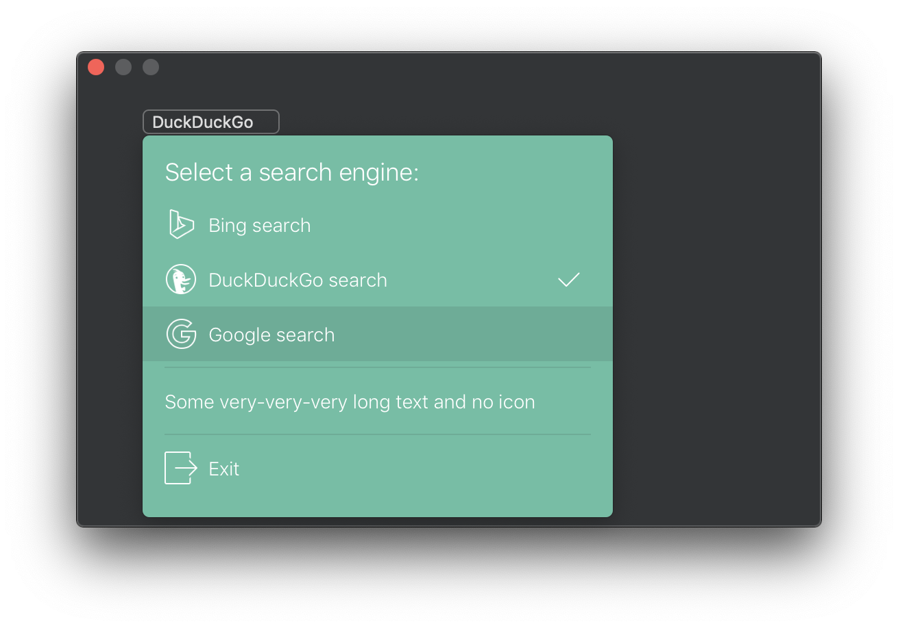

# Menu

Fully customizable Mac OS drop-down menu



## What can be customized? Everything!
```swift
public protocol Configuration {
    var titleBottomSpace: CGFloat                           { get }
    var titleFont: NSFont?                                  { get }
    var backgroundColor: NSColor                            { get }
    var cornerRadius: CGFloat                               { get }
    var hasShadow: Bool                                     { get }
    var appearsBelowSender: Bool                            { get }
    var contentEdgeInsets: NSEdgeInsets                     { get }
    var separatorColor: NSColor                             { get }
    var separatorThickness: CGFloat                         { get }
    var separatorHorizontalPadding: Padding.Horizontal      { get }
    var separatorVerticlaPadding: Padding.Vertical          { get }
    var rememberSelection: Bool                             { get }
    var textAlignment: Alignment                            { get }
    var iconAlignment: Alignment                            { get }
    var menuItemFont: NSFont?                               { get }
    var menuItemHeight: CGFloat                             { get }
    var menuItemHoverBackgroundColor: NSColor               { get }
    var menuItemTextColor: NSColor                          { get }
    var menuItemHoverTextColor: NSColor                     { get }
    var menuItemCheckmarkColor: NSColor                     { get }
    var menuItemHoverCheckmarkColor: NSColor                { get }
    var menuItemCheckmarkHeight: CGFloat                    { get }
    var menuItemCheckmarkThikness: CGFloat                  { get }
    var menuItemImageHeight: CGFloat?                       { get }
    var menuItemImageTintColor: NSColor?                    { get }
    var menuItemHoverImageTintColor: NSColor?               { get }
}

```
## How to use

```swift
import Cocoa
import Menu

class ViewController: NSViewController {
    private let myMenu = Menu(with: "Select a search engine:")

    @IBAction func didClickedButton(_ sender: NSButton) {
        myMenu.show(items: [
            MenuItem("Bing search", image: NSImage(named: "icons8-bing-50"), action: {
                sender.title = "Bing"
            }),
            MenuItem("DuckDuckGo search", image: NSImage(named: "icons8-duckduckgo-50"), action: {
                sender.title = "DuckDuckGo"
            }),
            MenuItem("Google search", image: NSImage(named: "icons8-google-50"), action: {
                sender.title = "Google"
            }),
            MenuItem.separator(),
            MenuItem("Some very-very-very long text and no icon", action: {
                sender.title = "Some very long text"
            }),
            MenuItem.separator(),
            MenuItem("Exit", image: NSImage(named: "icons8-exit-50"), action: {
                NSApplication.shared.terminate(nil)
            })
        ], view: sender)
    }
}
```

