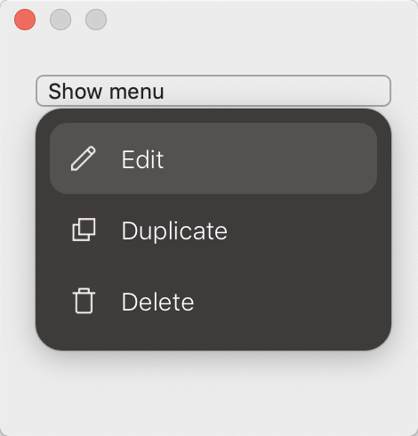

## Example



### Code:

```
class Config: MenuConfiguration {
    override var cornerRadius: CGFloat {
        return 15.0
    }

    override var backgroundColor: NSColor {
        return NSColor(red: 63/255, green: 59/255, blue: 59/255, alpha: 1.0)
    }

    override var menuItemHoverBackgroundColor: NSColor {
        return NSColor(red: 86/255, green: 81/255, blue: 81/255, alpha: 1.0)
    }

    override var menuItemHoverCornerRadius: CGFloat {
        return 10.0
    }

    override var contentEdgeInsets: NSEdgeInsets {
        return NSEdgeInsets(top: 8, left: 16, bottom: 8, right: 16)
    }

    override var menuItemHeight: CGFloat {
        return 40.0
    }

    override var menuItemHoverEdgeInsets: NSEdgeInsets {
        return NSEdgeInsets(top: 0, left: 8, bottom: 0, right: 8)
    }
}
```

